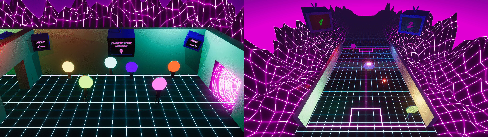

# Smack Back
Traphouse Table-Tennis made in a week for UTS Game Development Studio 1.
 
**Gameplay: https://www.youtube.com/watch?v=BTg2pMMQKwY**

## Instructions
* Local two player controls with WASD and the arrow keys
* Select your paddle colour in the main menu
* Get the ball past the opponents line to score. 3 points if in the center box
* First to 7 wins

## Run Game
Download and run from the [itch.io page](https://team-allcaps.itch.io/smack-back)